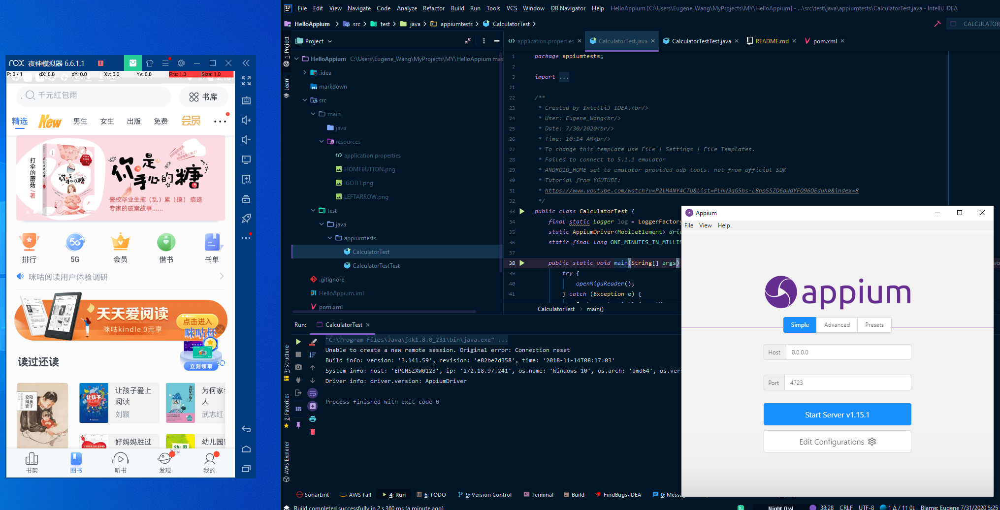
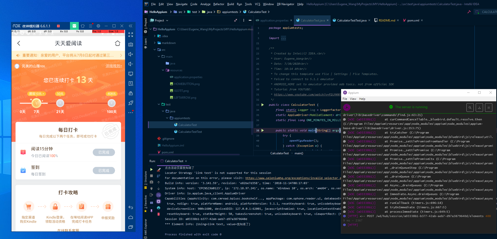

##Nox模拟器成功配置记录
<ol>
 <li>There is serious compatible issue with SDK version and Appium Version and Android Emulator Version</li>
 <li>Appium 1.16 not compatible with Nox Emulator Android version 6.1.2</li>
 <li>Appium 1.15 compatible with Nox Emulator Android version 6.1.2</li>
 <li>Android SDK version 5.1 Lollipop</li>
 <li>Don't use AVD from Android studio, x86 version not compatible with apk compiled with arm instructions</li>
</ol>
 
## Steps to set up the automated app testing environment
<ol>
<li>get Java and set up JAVA_HOME</li>
<li>get NodeJs installed version 6.12.1 npm --version</li>
<li>get Android Studio installed </li>
<li>install SDk (5.1 API level 24) via Android Studio, set Android_HOME environment variable</li>
<li>install Appium version 1.15</li>
<li>check with appium-doctor --android for dependencies completeness</li>
<li>install APK info to find the required info for app activity </li>
<li>install cmake first </li>
<li>https://github.com/Kitware/CMake/releases/download/v3.18.1/cmake-3.18.1-win64-x64.msi</li>
<li>npm i -g opencv4nodejs</li>
</ol>

##APPs links:
http://appium.io/downloads.html
https://developer.android.google.cn/studio/
https://www.memuplay.com/

##MeMu 逍遥模拟器7.1.2 (以下都是实测可行的配置参数)
设置-》开发者模式-》打开坐标/打开USB调试/ 
Google Frame installation -> ApkInfo App

##Appium Desktop Settings Json
{
  "platformName": "Android",
  "platformVersion": "7.1.2",
  "deviceName": "127.0.0.1:21503",
  "noReset": true,
  "noSign": true,
  "unicodeKeyboard": true,
  "appPackage": "com.ophone.reader.ui",
  "appActivity": "com.cmread.bplusc.bookshelf.LocalMainActivity"
}

##Android studio
sdk manager -> api level
appium

##环境变量设置 
ANDROID_HOME=C:\Users\eugene\AppData\Local\Android\Sdk
ANDROID_SDK_ROOT=C:\Users\eugene\AppData\Local\Android\Sdk
APPDATA=C:\Users\eugene\AppData\Roaming
ChocolateyInstall=C:\ProgramData\chocolatey
ChocolateyLastPathUpdate=132456609379932831
ChocolateyToolsLocation=C:\tools
CommonProgramFiles=C:\Program Files\Common Files
CommonProgramFiles(x86)=C:\Program Files (x86)\Common Files
CommonProgramW6432=C:\Program Files\Common Files
COMPUTERNAME=DESKTOP-3Q5911B
ComSpec=C:\WINDOWS\system32\cmd.exe
DriverData=C:\Windows\System32\Drivers\DriverData
GIT_HOME=C:\Program Files\Git
HOMEDRIVE=C:
HOMEPATH=\Users\eugene
JAVA_HOME=C:\Program Files\Java\jdk-15
LOCALAPPDATA=C:\Users\eugene\AppData\Local
LOGONSERVER=\\DESKTOP-3Q5911B
M2_HOME=C:\ProgramData\chocolatey\lib\maven\apache-maven-3.6.3
NUMBER_OF_PROCESSORS=24
OneDrive=C:\Users\eugene\OneDrive
OneDriveConsumer=C:\Users\eugene\OneDrive
OS=Windows_NT
Path=C:\Program Files\Common Files\Oracle\Java\javapath;C:\WINDOWS\system32;C:\WINDOWS;C:\WINDOWS\System32\Wbem;
C:\WINDOWS\System32\WindowsPowerShell\v1.0\;C:\WINDOWS\System32\OpenSSH\;C:\ProgramData\chocolatey\bin;
C:\ProgramData\chocolatey\lib\maven\apache-maven-3.6.3\bin;C:\Program Files\Git\cmd;C:\Program Files\dotnet\;
C:\Program Files (x86)\dotnet\;C:\Program Files\nodejs\;C:\Program Files\Java\jdk-15\bin;C:\Users\eugene\AppData\Local\Android\Sdk\bin;
C:\Users\eugene\AppData\Local\Android\Sdk\bin;C:\Users\eugene\AppData\Local\Android\Sdk\platform-tools;C:\Program Files\NVIDIA Corporation\NVIDIA NvDLISR;
C:\Program Files\Git\bin;C:\Users\eugene\AppData\Local\Microsoft\WindowsApps;C:\Users\eugene\AppData\Local\GitHubDesktop\bin;
C:\Users\eugene\AppData\Local\Programs\Microsoft VS Code\bin;C:\Users\eugene\AppData\Roaming\npm
> gci env:* | sort-object name

### adb devices 必须显示出来
> PS C:\Users\eugene\IdeaProjects\HelloAppium> adb devices
List of devices attached
127.0.0.1:21503 device

### 如果不显示， 解决办法尝试1
>adb connect 127.0.0.1:21503
>adb devices

## version 一定要对，版本不对，连不上！
正确的版本

RUNNING

DONATE 技术支持

##Author 
Eugene Wang ALLRIGHTS RESERVED@2020
[GIT](https://github.com/sail456852/HelloAppium)
